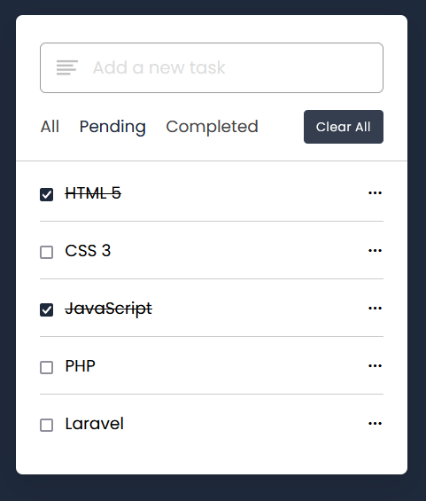

# Day #15

### ToDo App
This code appears to be part of a JavaScript to-do list project. It includes features such as adding tasks, editing existing tasks, marking tasks as completed or pending, filtering tasks based on status (all, completed, pending), and deleting tasks. The code also makes use of local storage (localStorage) to persist tasks, allowing data to remain available even after the page is refreshed.❗️

# Screenshot
Here we have project screenshot :

