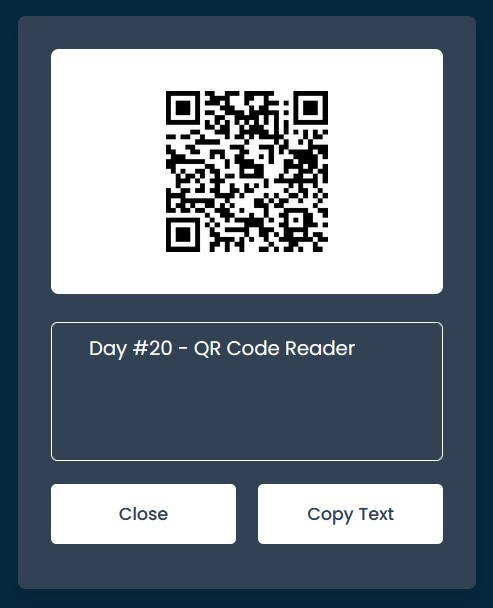

# Day #20

### QR Code Reader

This JavaScript code creates an application to scan and display data from a QR code❗️

#### Day #4 Link

<a href="https://github.com/adudecoder/100DaysOfCode/tree/main/Day%20%2304%20-%20QR%20Code%20Generator" target="_blank">QR Code Generator Source</a>

# Screenshot

Here we have project screenshot :

