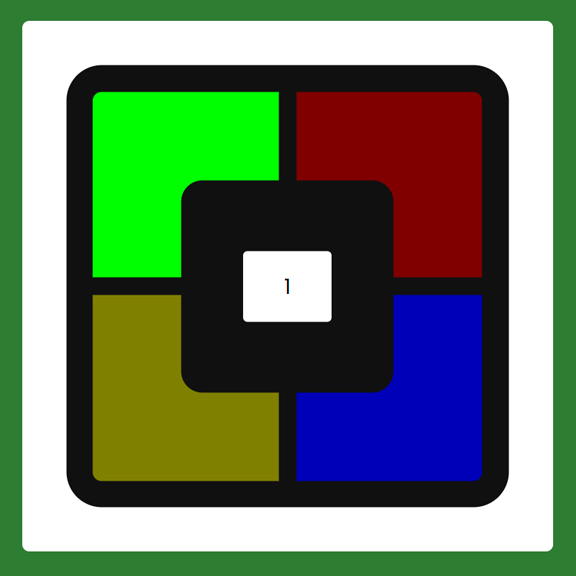

# Day #24

### Simon Game
This code implements an interactive game where the player must follow a randomly generated color path. The player clicks on the colors in the correct sequence, and the game increases the difficulty by adding more colors to the path. The score is displayed, and the game can be restarted at any time.❗️

# Screenshot
Here we have project screenshot :

