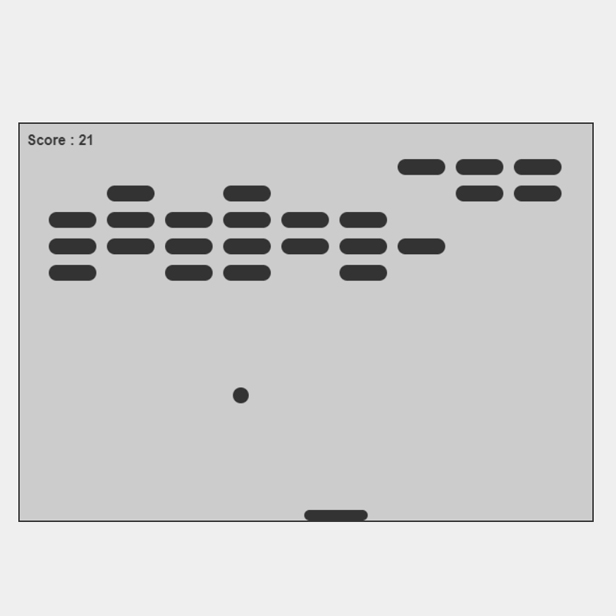

# Day #29

### Breakout Game
This JavaScript code implements a simple "Breakout" or "Arkanoid" style game, where the player controls a paddle (racket) to bounce a ball and break bricks❗️

# Screenshot
Here we have project screenshot :

