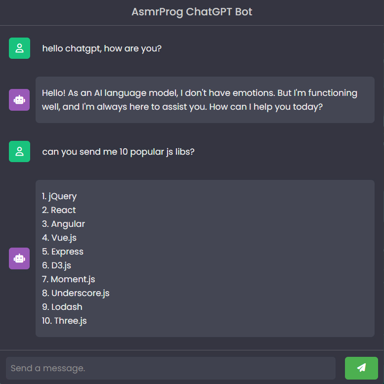

# Day #31

### ChatGPT Bot
This code implements a simple chat interface with API integration. It allows users to send messages and receive responses from the bot. Messages and user interface are dynamically handled with JavaScript.

## Warning
You need to get your own api key (in video we showed how!) and replace it in index.js file on line 46 :

```javascript
'X-RapidAPI-Key': 'Your Key',
```


# Screenshot
Here we have project screenshot :

