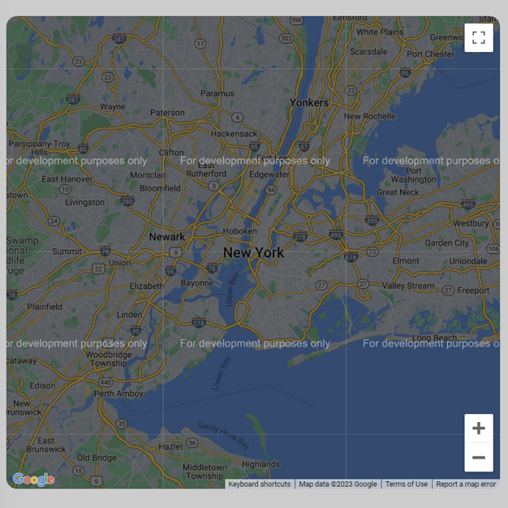

# Day #32

### Google Maps
This code uses the Google Maps API to create an interactive map. It initializes the map with specific options, adds a marker (pointer) at a certain location, and displays an information window when clicking the marker. Additionally, it automatically adjusts the center of the map when the browser window is resized.

# Screenshot
Here we have project screenshot :

