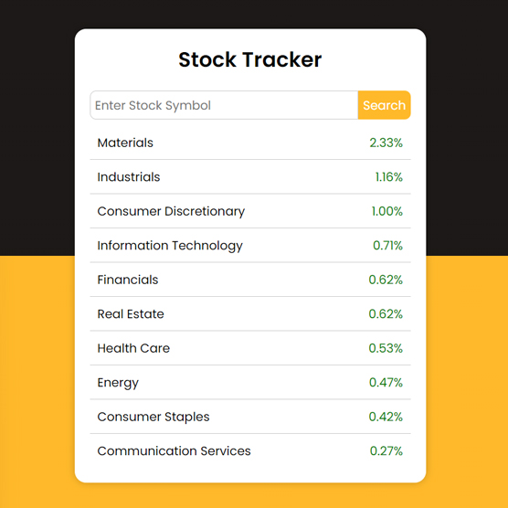

# Day #36

### Stock Tracker App
This JavaScript code uses the Alpha Vantage API to fetch and display information about stocks❗️

## Warning
You need to get your own api key (in video we showed how!) and replace it in index.js file on line 7 and 37 :

##### Line 7 :

```javascript
'https://www.alphavantage.co/query?function=SECTOR&apikey=YOUR_API_KEY'
```

##### Line 37 :

```javascript
https://www.alphavantage.co/query?function=GLOBAL_QUOTE&symbol=${symbol}&apikey=YOUR_API_KEY
```


# Screenshot
Here we have project screenshot :

