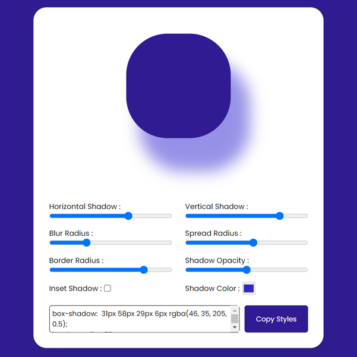

# Day #37

### Box Shadow Generator
This JavaScript code manipulates an interface that allows users to adjust the box-shadow and border properties of the view element. The generated styles are displayed and can be copied.❗️

# Screenshot
Here we have project screenshot :

