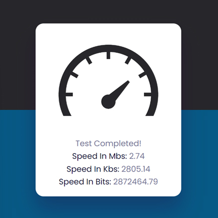

# Day #40

### Detect Internet Speed
This JavaScript code performs a network speed test by loading a random image from Unsplash multiple times and measuring the time it takes to download each image.❗️

# Screenshot
Here we have project screenshot :

