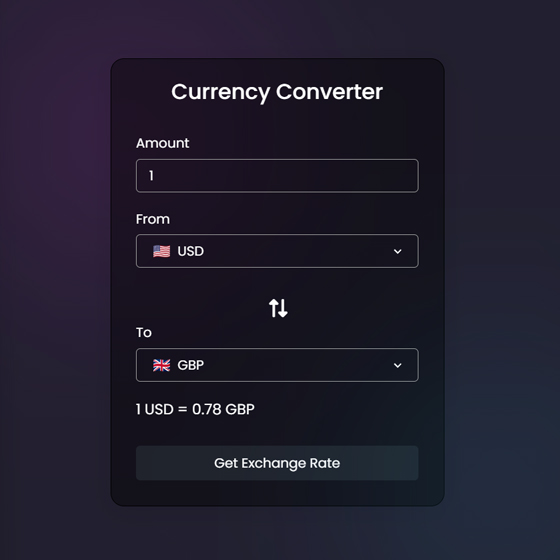

# Day #41

### Movie App (TheMovieDB)
This JavaScript code creates an exchange rate calculator that allows users to convert values from one currency to another. Currency values are obtained from an exchange rate API.❗️

## Warning
You need to get your own api key (in video we showed how!) and replace it in index.js file on line 28 :

```javascript
const response = await fetch(`https://v6.exchangerate-api.com/v6/[YOUR_KEY]]/latest/${fromCur.value}`);
```


# Screenshot
Here we have project screenshot :


