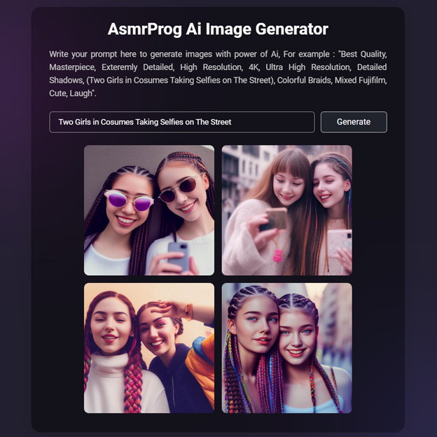

# Day #48

### Ai Image Generator
This code uses the OpenAI API to generate images based on user-supplied prompts.❗️

## Warning
You need to get your own api key and replace it in script.js file on line 1 :

```javascript
const apiKey = "YOUR_API_KEY";
```


# Screenshot
Here we have project screenshot :


