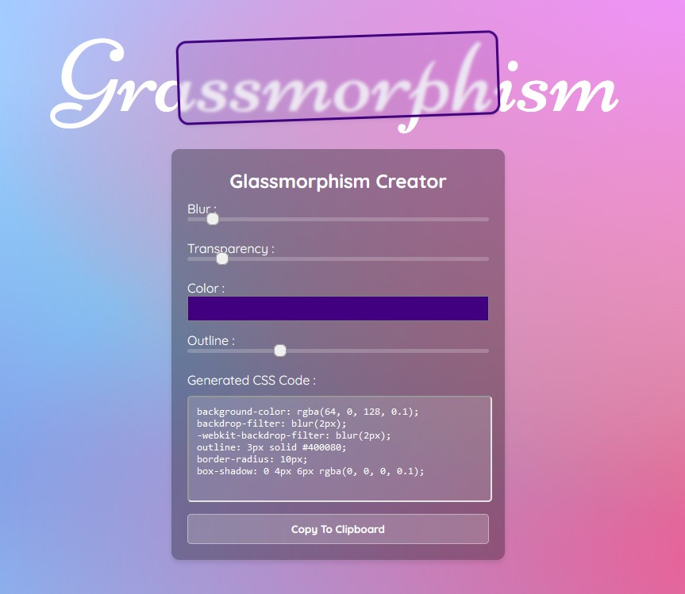

# Day #54

### Glassmorphism Generator
This code allows you to generate an interactive glassmorphism effect, allowing you to adjust parameters such as blur, transparency, color and contour.❗️

# Screenshot
Here we have project screenshot :

