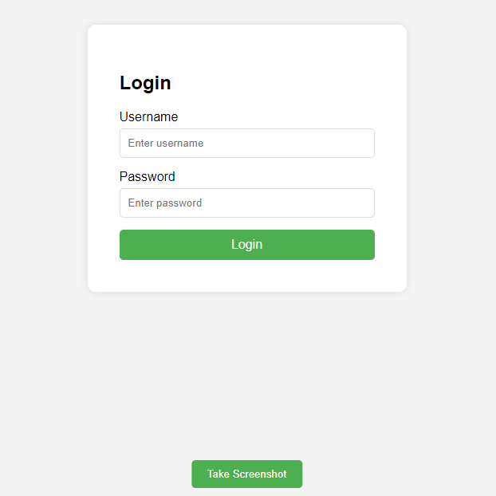

# Day #65

### Capture Screenshot
This code, when clicking on the 'screenshotBtn' button, temporarily hides the button, captures an image of the page using the html2canvas library, converts the image to a URL format and makes it available for download as 'screenshot.png'. The button is then displayed again.❗️

# Screenshot
Here we have project screenshot :

