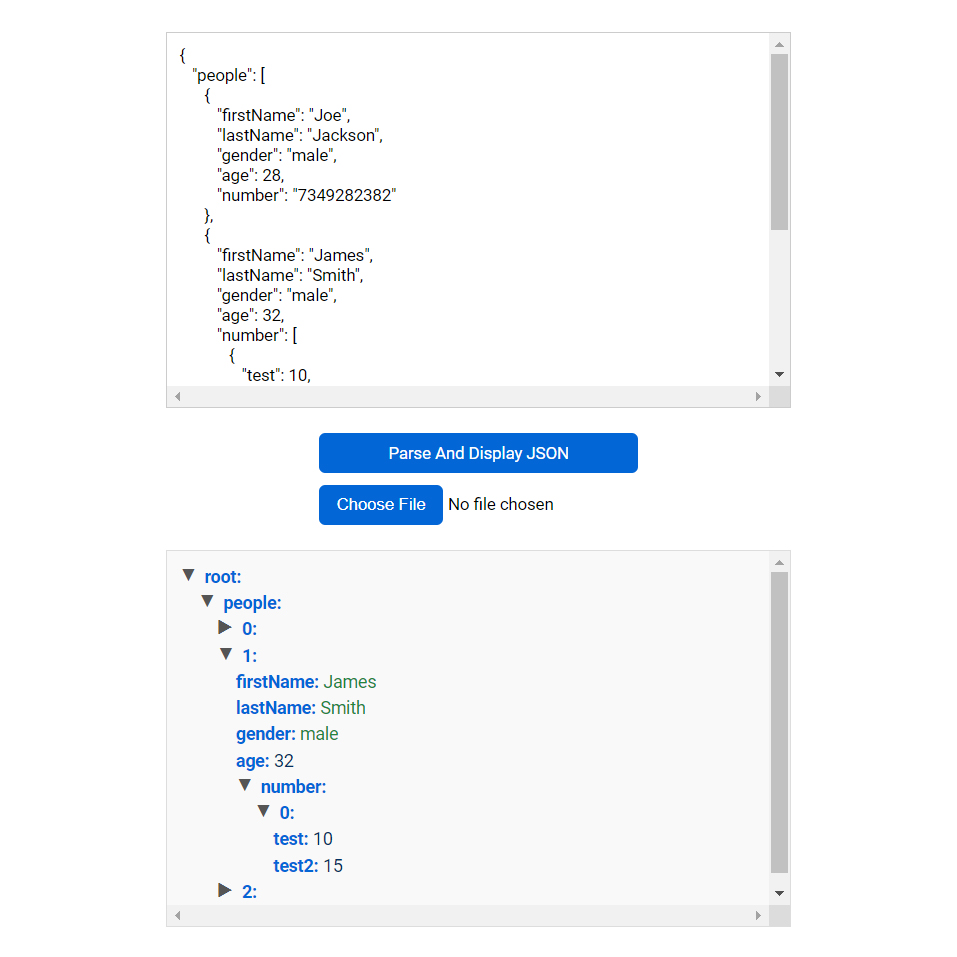

# Day #68

### JSON Parser
This JavaScript code implements an interactive JSON viewer.❗️

### 🌟 What You'll Learn:
- Understanding JSON: Learn how to parse json files!
- How to get type of data
- Working with all json types

# Screenshot
Here we have project screenshot :

