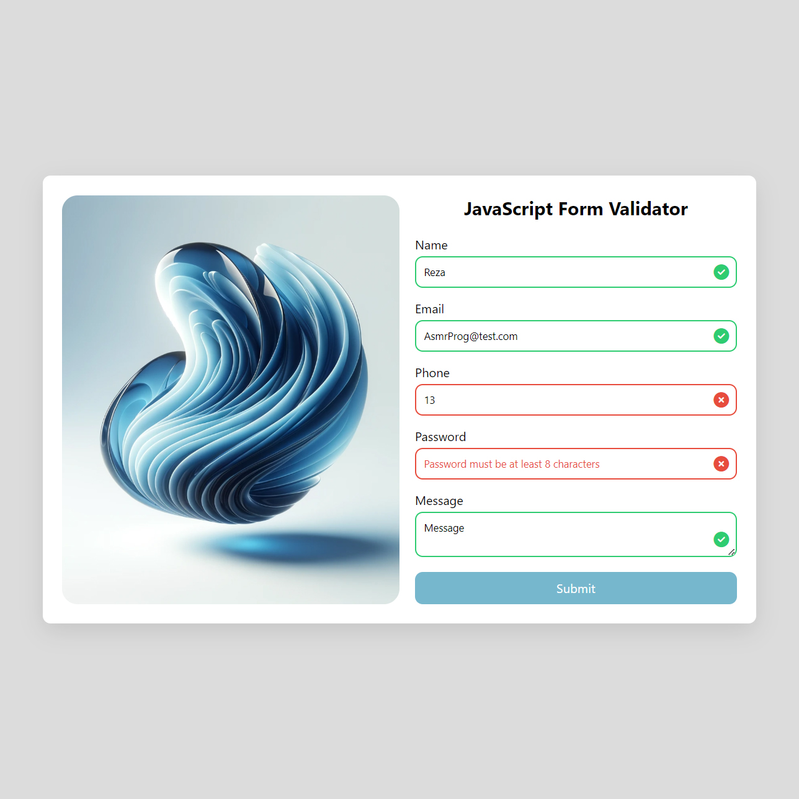

# Day #69

### JSON Parser
The code provides interactive validation for form fields and displays a success modal upon successful submission.❗️

### 🌟 What You'll Learn:
- Understanding JS Functions: Learn how to use javascript functions!
- How to validate forms
- Working with html inputs

# Screenshot
Here we have project screenshot :

